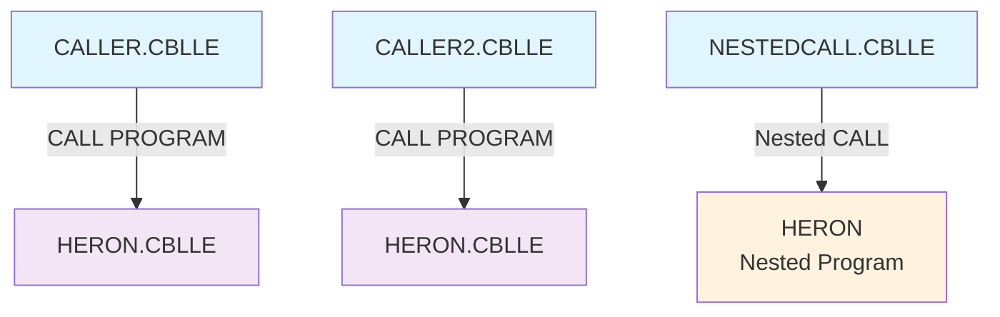

# COBOL Dependency Reference - CallingExample

## Overview
This document provides a comprehensive analysis of the COBOL program dependencies within the CallingExample project. The project demonstrates various COBOL calling patterns on AS400/IBM i systems.

> 🔧 **NEW: Automation Tools Available!** Check out the [`tools/`](tools/) directory for automated dependency scanning, code validation, templates, and build instructions to streamline your COBOL development workflow.

## Program Inventory

| Program | Type | Purpose | Lines of Code |
|---------|------|---------|---------------|
| CALLER.CBLLE | Main Program | External program calling example | 17 |
| CALLER2.CBLLE | Main Program | Duplicate of CALLER.CBLLE | 17 |
| HERON.CBLLE | Called Program | Triangle area calculation using Heron's formula | 24 |
| NESTEDCALL.CBLLE | Main Program | Nested program calling example | 43 |

## Dependency Structure

### Program Call Dependencies



#### External Program Calls
- **CALLER.CBLLE** → **HERON.CBLLE**
  - Call Type: External program call
  - Parameters: A, B, C (triangle sides), AREA (result)
  - Call Statement: `CALL PROGRAM "HERON" USING A B C AREA`

- **CALLER2.CBLLE** → **HERON.CBLLE**
  - Call Type: External program call
  - Parameters: A, B, C (triangle sides), AREA (result)
  - Call Statement: `CALL PROGRAM "HERON" USING A B C AREA`

#### Nested Program Calls
- **NESTEDCALL.CBLLE** contains nested **HERON** program
  - Call Type: Nested program call
  - Parameters: A, B, C (triangle sides), AREA (result)
  - Call Statement: `CALL "HERON" USING A B C AREA`

### Data Flow Dependencies

#### Common Data Structures
All programs share a consistent data structure pattern:

```cobol
01 A      PACKED-DECIMAL  PICTURE S9(10)V9(5)
01 B      PACKED-DECIMAL  PICTURE S9(10)V9(5)  
01 C      PACKED-DECIMAL  PICTURE S9(10)V9(5)
01 AREA   PACKED-DECIMAL  PICTURE S9(10)V9(5)
```

#### Parameter Flow

| Parameter | Direction | Purpose | Data Type |
|-----------|-----------|---------|-----------|
| A | IN | Triangle side length | PACKED-DECIMAL S9(10)V9(5) |
| B | IN | Triangle side length | PACKED-DECIMAL S9(10)V9(5) |
| C | IN | Triangle side length | PACKED-DECIMAL S9(10)V9(5) |
| AREA | OUT | Calculated triangle area | PACKED-DECIMAL S9(10)V9(5) |

#### Data Transformation
```
Input: Triangle sides (A, B, C)
  ↓
HERON Program Logic:
  1. Validate triangle sides (triangle inequality)
  2. Calculate semi-perimeter: S = (A + B + C) / 2
  3. Apply Heron's formula: AREA = √(S × (S-A) × (S-B) × (S-C))
  ↓
Output: Triangle area (AREA) or -1.0 for invalid triangles
```

### Copybook Dependencies
**No copybooks found** - All data structures are defined locally within each program.

### Circular Dependencies Analysis
**No circular dependencies detected** - The call structure is unidirectional:
- Main programs call HERON
- HERON does not call back to main programs
- No mutual dependencies between programs

## Legacy Patterns Analysis

### AS400/IBM i Specific Patterns

1. **PACKED-DECIMAL Usage**
   - All numeric variables use PACKED-DECIMAL data type
   - Standard AS400 pattern for efficient storage and performance
   - Picture clause: `S9(10)V9(5)` (10 integer digits, 5 decimal places, signed)

2. **Program Calling Conventions**
   - External calls use `CALL PROGRAM` syntax
   - Nested calls use `CALL` without PROGRAM keyword
   - Parameter passing via USING clause

3. **LINKAGE SECTION Pattern**
   - HERON.CBLLE properly defines LINKAGE SECTION for external calls
   - Parameters redefined in LINKAGE SECTION match calling program structure

4. **GOBACK vs STOP RUN**
   - Called programs use GOBACK (proper pattern for called programs)
   - Main programs should use STOP RUN (not consistently implemented)

### Code Quality Issues

#### Variable Name Inconsistencies
- **CALLER.CBLLE & CALLER2.CBLLE**: Reference undefined variable `PLOCHA-DISPLAYED`
  - Should reference `AREA-DISP` (defined on line 9)
  - Line 15: `DISPLAY "AREA = " PLOCHA-DISPLAYED` should be `DISPLAY "AREA = " AREA-DISP`

- **NESTEDCALL.CBLLE**: Reference undefined variables `PLOCHA` and `PLOCHA-DISPLAYED`
  - Should reference `AREA` and `AREA-DISP` respectively
  - Line 13: `MOVE PLOCHA TO PLOCHA-DISPLAYED` should be `MOVE AREA TO AREA-DISP`
  - Line 14: `DISPLAY "PLOCHA = " PLOCHA-DISPLAYED` should be `DISPLAY "AREA = " AREA-DISP`

## Modularity Recommendations

### Current Strengths
1. **Clear Separation of Concerns**: HERON program focused solely on mathematical calculation
2. **Reusable Design**: HERON can be called from multiple programs
3. **Consistent Interface**: All programs use same parameter structure

### Improvement Recommendations

#### 1. Code Deduplication
- **Issue**: CALLER.CBLLE and CALLER2.CBLLE are identical
- **Recommendation**: Remove duplicate program or differentiate functionality

#### 2. Error Handling Enhancement
```cobol
* Current pattern in HERON:
IF A >= B + C OR B >= A + C OR C >= A + B
   MOVE -1.0 TO AREA
   GOBACK
END-IF

* Recommended enhancement:
01 ERROR-CODE     PIC 9(2) VALUE 0.
   88 VALID-TRIANGLE    VALUE 0.
   88 INVALID-TRIANGLE  VALUE 1.

IF A >= B + C OR B >= A + C OR C >= A + B
   SET INVALID-TRIANGLE TO TRUE
   MOVE -1.0 TO AREA
ELSE
   SET VALID-TRIANGLE TO TRUE
   * Continue with calculation
END-IF
```

#### 3. Copybook Introduction
Create shared copybooks for:
- Common data structures (`TRIANGLE-PARAMETERS.CPY`)
- Error codes and messages (`ERROR-CODES.CPY`)
- Display formats (`DISPLAY-FORMATS.CPY`)

#### 4. Standardized Naming Convention
- Implement consistent variable naming across all programs
- Use meaningful names (e.g., `TRIANGLE-AREA` instead of `AREA`)
- Follow AS400 naming conventions consistently

#### 5. Program Structure Enhancement
```cobol
* Recommended main program structure:
PROCEDURE DIVISION.
0000-MAIN-PROCESS.
    PERFORM 1000-INITIALIZE
    PERFORM 2000-PROCESS-CALCULATION  
    PERFORM 3000-DISPLAY-RESULTS
    PERFORM 9000-TERMINATE
    STOP RUN.

1000-INITIALIZE.
    * Initialization logic
    
2000-PROCESS-CALCULATION.
    CALL PROGRAM "HERON" USING A B C AREA
    
3000-DISPLAY-RESULTS.
    * Display logic
    
9000-TERMINATE.
    * Cleanup logic
```

## Quick Start with Automation Tools

To leverage the new automation capabilities:

### 1. 🔍 Validate Code Quality
```bash
cd /path/to/QCBLLESRC
./tools/validate-variables.sh *.CBLLE
```

### 2. 📊 Generate Dependency Report  
```powershell
cd /path/to/QCBLLESRC
.\tools\dependency-scanner.ps1 -SourcePath "." -OutputFormat "markdown" -OutputFile "current-analysis.md"
```

### 3. 🚀 Create New Programs
```bash
cp tools/PROGRAM-TEMPLATE.CBLLE NEW-PROGRAM.CBLLE
# Edit and customize the template
```

### 4. 🏗️ Build and Deploy
```bash
# Follow detailed instructions in tools/BUILD_INSTRUCTIONS.md
CRTCBLMOD MODULE(MYLIB/HERON) SRCFILE(MYLIB/QCBLLESRC) SRCMBR(HERON)
CRTPGM PGM(MYLIB/HERON) MODULE(MYLIB/HERON)
```

> 📁 **Complete documentation:** [`tools/README.md`](tools/README.md)

## Dependencies Summary

- **Total Programs**: 4
- **External Dependencies**: 2 (CALLER → HERON, CALLER2 → HERON)
- **Nested Dependencies**: 1 (NESTEDCALL contains HERON)
- **Copybook Dependencies**: 0
- **Circular Dependencies**: 0
- **Data Dependencies**: Shared parameter structure across all programs

## Migration Considerations

When modernizing this codebase:

1. **Maintain AS400 Data Types**: PACKED-DECIMAL is optimal for AS400 performance
2. **Preserve Call Structure**: The modular design is sound
3. **Address Variable Name Issues**: Fix undefined variable references
4. **Consider Service Programs**: Convert to service programs for better reusability
5. **Add Comprehensive Error Handling**: Implement proper error codes and logging

## Automation Tools & Best Practices

### 🔧 Dependency Scanner Script

A PowerShell/Shell script to automatically analyze COBOL dependencies:

> 📁 **Available in:** [`tools/dependency-scanner.ps1`](tools/dependency-scanner.ps1)

```powershell
# dependency-scanner.ps1 - Automated COBOL Dependency Analysis
param(
    [string]$SourcePath = ".",
    [string]$OutputFormat = "markdown"
)

# Usage examples:
.\dependency-scanner.ps1 -SourcePath "." -OutputFormat "json"
.\dependency-scanner.ps1 -SourcePath "." -OutputFormat "markdown" -OutputFile "report.md"
```

**Features:**
- Scans COBOL source files for program dependencies
- Extracts variable definitions and references  
- Generates reports in multiple formats (Markdown, JSON, CSV)
- Creates Mermaid dependency diagrams
- Provides program statistics and metrics

### 🎯 Code Quality Validation Tools

#### Variable Reference Validator

> 📁 **Available in:** [`tools/validate-variables.sh`](tools/validate-variables.sh)

```bash
#!/bin/bash
# validate-variables.sh - Check for undefined variable references

# Usage examples:
./validate-variables.sh *.CBLLE
./validate-variables.sh CALLER.CBLLE HERON.CBLLE
```

**Features:**
- Detects undefined variable references (like PLOCHA-DISPLAYED in CALLER.CBLLE)
- Checks for missing periods and syntax issues
- Validates comment alignment for fixed-format COBOL
- Identifies inconsistent indentation
- Provides actionable error reports with line numbers

**Sample validation output for this project:**
```
Validating: CALLER.CBLLE
  ⚠️  UNDEFINED VARIABLE: PLOCHA-DISPLAYED (referenced at line: 15)
  ❌ Found 1 undefined variable reference(s)
```

### 📋 Program Documentation Template

> 📁 **Available in:** [`tools/PROGRAM-TEMPLATE.CBLLE`](tools/PROGRAM-TEMPLATE.CBLLE)

Standardized COBOL program template following AS400 best practices:

```cobol
      * ===============================================
      * PROGRAM: [PROGRAM-NAME]
      * PURPOSE: [Brief description of program purpose]
      * AUTHOR:  [Developer name]
      * DATE:    [Creation date - YYYY-MM-DD]
      * VERSION: [Version number - V1.0.0]
      * ===============================================
      * DEPENDENCIES:
      *   - Called Programs: [List external programs called]
      *   - Copybooks: [List copybooks included]
      *   - Files: [List files accessed]
      * ===============================================
      * PARAMETERS:
      *   INPUT:  [List input parameters with descriptions]
      *   OUTPUT: [List output parameters with descriptions]
      * ===============================================
      * ERROR CODES:
      *   0000 - Success
      *   0001 - Invalid input parameters
      *   0002 - Processing error
      * ===============================================
      
       IDENTIFICATION DIVISION.
       PROGRAM-ID. [PROGRAM-NAME].
       
       WORKING-STORAGE SECTION.
       01 WS-PROGRAM-INFO.
           05 WS-PROGRAM-NAME    PIC X(10) VALUE '[PROGRAM-NAME]'.
           05 WS-VERSION         PIC X(8)  VALUE 'V1.0.0'.
           05 WS-LAST-MODIFIED   PIC X(10) VALUE '[DATE]'.
           
       01 WS-ERROR-HANDLING.
           05 WS-ERROR-CODE      PIC 9(4)  VALUE ZERO.
               88 SUCCESS            VALUE 0000.
               88 INVALID-INPUT      VALUE 0001.
           05 WS-ERROR-MESSAGE   PIC X(80) VALUE SPACES.
           
       PROCEDURE DIVISION.
       0000-MAIN-PROCESS.
           PERFORM 1000-INITIALIZE
           PERFORM 2000-MAIN-LOGIC
           PERFORM 9000-TERMINATE
           STOP RUN.
```

**Features:**
- Comprehensive documentation headers
- Standard error handling patterns
- Structured program flow (Initialize → Process → Terminate)
- Debug mode support
- Consistent variable naming conventions

### 🏗️ AS400 Build Instructions

> 📁 **Complete guide available in:** [`tools/BUILD_INSTRUCTIONS.md`](tools/BUILD_INSTRUCTIONS.md)

#### Quick Compilation Commands
```bash
# Compile individual COBOL program
CRTCBLMOD MODULE(MYLIB/HERON) SRCFILE(MYLIB/QCBLLESRC) SRCMBR(HERON)
CRTPGM PGM(MYLIB/HERON) MODULE(MYLIB/HERON)

# Batch compilation for CallingExample project
CRTCBLMOD MODULE(MYLIB/CALLER) SRCFILE(MYLIB/QCBLLESRC) SRCMBR(CALLER)
CRTCBLMOD MODULE(MYLIB/HERON) SRCFILE(MYLIB/QCBLLESRC) SRCMBR(HERON)
CRTPGM PGM(MYLIB/CALLER) MODULE(MYLIB/CALLER)
CRTPGM PGM(MYLIB/HERON) MODULE(MYLIB/HERON)
```

#### Build Dependencies Order
1. **HERON.CBLLE** - Compile first (called by others)
2. **CALLER.CBLLE, CALLER2.CBLLE** - Can compile after HERON
3. **NESTEDCALL.CBLLE** - Independent (contains nested HERON)

**The complete build guide includes:**
- Individual and batch compilation commands
- CL program for automated builds
- JCL templates for z/OS environments
- Makefile for modern development workflows
- Deployment scripts and automation
- Error troubleshooting guide
- Performance optimization recommendations

### 🧪 Unit Testing Framework

#### Test Program Template
```cobol
       IDENTIFICATION DIVISION.
       PROGRAM-ID. TEST-HERON.
       
       WORKING-STORAGE SECTION.
       01 TEST-RESULTS.
           05 TESTS-RUN         PIC 9(3) VALUE ZERO.
           05 TESTS-PASSED      PIC 9(3) VALUE ZERO.
           05 TESTS-FAILED      PIC 9(3) VALUE ZERO.
           
       01 TEST-DATA.
           05 TEST-A            PACKED-DECIMAL PIC S9(10)V9(5).
           05 TEST-B            PACKED-DECIMAL PIC S9(10)V9(5).
           05 TEST-C            PACKED-DECIMAL PIC S9(10)V9(5).
           05 TEST-AREA         PACKED-DECIMAL PIC S9(10)V9(5).
           05 EXPECTED-AREA     PACKED-DECIMAL PIC S9(10)V9(5).
           
       PROCEDURE DIVISION.
       0000-MAIN-TEST.
           PERFORM 1000-TEST-VALID-TRIANGLE
           PERFORM 1100-TEST-INVALID-TRIANGLE
           PERFORM 1200-TEST-EDGE-CASES
           PERFORM 9000-DISPLAY-RESULTS
           STOP RUN.
           
       1000-TEST-VALID-TRIANGLE.
      *    Test Case: Valid triangle (3,4,5) - Expected area: 6.0
           MOVE 3.0 TO TEST-A
           MOVE 4.0 TO TEST-B  
           MOVE 5.0 TO TEST-C
           MOVE 6.0 TO EXPECTED-AREA
           CALL PROGRAM "HERON" USING TEST-A TEST-B TEST-C TEST-AREA
           PERFORM 9100-VERIFY-RESULT.
           
       1100-TEST-INVALID-TRIANGLE.
      *    Test Case: Invalid triangle (1,2,5) - Expected area: -1.0
           MOVE 1.0 TO TEST-A
           MOVE 2.0 TO TEST-B
           MOVE 5.0 TO TEST-C
           MOVE -1.0 TO EXPECTED-AREA
           CALL PROGRAM "HERON" USING TEST-A TEST-B TEST-C TEST-AREA
           PERFORM 9100-VERIFY-RESULT.
           
       9100-VERIFY-RESULT.
           ADD 1 TO TESTS-RUN
           IF TEST-AREA = EXPECTED-AREA
               ADD 1 TO TESTS-PASSED
               DISPLAY "PASS: " TEST-A " " TEST-B " " TEST-C 
                       " => " TEST-AREA
           ELSE
               ADD 1 TO TESTS-FAILED
               DISPLAY "FAIL: " TEST-A " " TEST-B " " TEST-C
                       " Expected: " EXPECTED-AREA
                       " Actual: " TEST-AREA
           END-IF.
```

### 📊 Performance Optimization Guidelines

#### Memory Usage Optimization
```cobol
* Use PACKED-DECIMAL for numeric calculations (AS400 optimized)
01 EFFICIENT-NUMERIC    PACKED-DECIMAL PIC S9(10)V9(5).

* Avoid unnecessary data movements
* Use COMPUTATIONAL fields for intermediate calculations
01 CALC-FIELD          PIC S9(9) COMP.

* Initialize variables efficiently
INITIALIZE WS-WORK-AREA.
* Instead of individual MOVE ZERO statements
```

#### Call Performance Best Practices
```cobol
* Use static calls when possible (compile-time binding)
CALL 'HERON' USING A B C AREA.

* Minimize parameter passing overhead
* Group related parameters in data structures
01 TRIANGLE-PARAMS.
    05 SIDE-A          PACKED-DECIMAL PIC S9(10)V9(5).
    05 SIDE-B          PACKED-DECIMAL PIC S9(10)V9(5).
    05 SIDE-C          PACKED-DECIMAL PIC S9(10)V9(5).
    05 CALCULATED-AREA PACKED-DECIMAL PIC S9(10)V9(5).

CALL 'HERON' USING TRIANGLE-PARAMS.
```

### 🔄 Migration Roadmap & Timeline

#### Phase 1: Immediate Improvements (1-2 weeks)
- [ ] Fix undefined variable references
- [ ] Implement standardized naming conventions
- [ ] Add error handling patterns
- [ ] Create program documentation headers

#### Phase 2: Code Quality Enhancement (2-4 weeks)
- [ ] Introduce copybooks for shared data structures
- [ ] Implement unit testing framework
- [ ] Add comprehensive error codes
- [ ] Create build automation scripts

#### Phase 3: Modernization (4-8 weeks)
- [ ] Convert to service programs where appropriate
- [ ] Implement logging and monitoring
- [ ] Add performance profiling
- [ ] Create integration interfaces

#### Phase 4: Advanced Features (8-12 weeks)
- [ ] Implement continuous integration
- [ ] Add automated testing pipeline
- [ ] Create documentation generation tools
- [ ] Implement code quality metrics dashboard

### 🛡️ Security Best Practices

```cobol
* Input validation example
PROCEDURE DIVISION USING INPUT-PARAMS.
    PERFORM 1000-VALIDATE-INPUT
    IF VALID-INPUT
        PERFORM 2000-PROCESS-REQUEST
    ELSE
        PERFORM 9000-HANDLE-ERROR
    END-IF.

1000-VALIDATE-INPUT.
* Validate numeric ranges
    IF A <= 0 OR B <= 0 OR C <= 0
        SET INVALID-INPUT TO TRUE
        MOVE "Invalid triangle dimensions" TO ERROR-MESSAGE
    END-IF.
    
* Validate data types and bounds
    IF A > 999999.99999 OR B > 999999.99999 OR C > 999999.99999
        SET INVALID-INPUT TO TRUE
        MOVE "Triangle dimensions too large" TO ERROR-MESSAGE
    END-IF.
```

### 📈 Code Quality Metrics

#### Recommended Quality Gates
- **Cyclomatic Complexity**: < 10 per program
- **Lines of Code**: < 500 per program
- **Comment Ratio**: > 20% meaningful comments
- **Test Coverage**: > 80% of code paths
- **Code Duplication**: < 5% duplicate code blocks

#### Quality Checklist
- [ ] All variables properly defined
- [ ] Consistent naming conventions used
- [ ] Error handling implemented
- [ ] Input validation present
- [ ] Documentation headers complete
- [ ] Unit tests created
- [ ] Performance considerations addressed

---

*Generated on: 2025-07-21*  
*Analyzed Programs: CALLER.CBLLE, CALLER2.CBLLE, HERON.CBLLE, NESTEDCALL.CBLLE*  
*Analysis Type: Static code analysis and dependency mapping*  
*Enhanced with: Automation tools, testing framework, and best practices*