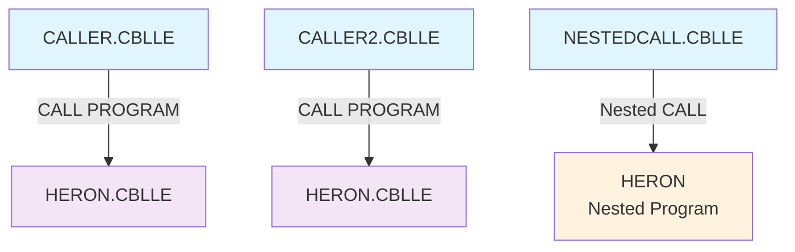

# COBOL Dependency Reference - CallingExample

## Overview
This document provides a comprehensive analysis of the COBOL program dependencies within the CallingExample project. The project demonstrates various COBOL calling patterns on AS400/IBM i systems.

## Program Inventory

| Program | Type | Purpose | Lines of Code |
|---------|------|---------|---------------|
| CALLER.CBLLE | Main Program | External program calling example | 17 |
| CALLER2.CBLLE | Main Program | Duplicate of CALLER.CBLLE | 17 |
| HERON.CBLLE | Called Program | Triangle area calculation using Heron's formula | 24 |
| NESTEDCALL.CBLLE | Main Program | Nested program calling example | 43 |

## Dependency Structure

### Program Call Dependencies



#### External Program Calls
- **CALLER.CBLLE** → **HERON.CBLLE**
  - Call Type: External program call
  - Parameters: A, B, C (triangle sides), AREA (result)
  - Call Statement: `CALL PROGRAM "HERON" USING A B C AREA`

- **CALLER2.CBLLE** → **HERON.CBLLE**
  - Call Type: External program call
  - Parameters: A, B, C (triangle sides), AREA (result)
  - Call Statement: `CALL PROGRAM "HERON" USING A B C AREA`

#### Nested Program Calls
- **NESTEDCALL.CBLLE** contains nested **HERON** program
  - Call Type: Nested program call
  - Parameters: A, B, C (triangle sides), AREA (result)
  - Call Statement: `CALL "HERON" USING A B C AREA`

### Data Flow Dependencies

#### Common Data Structures
All programs share a consistent data structure pattern:

```cobol
01 A      PACKED-DECIMAL  PICTURE S9(10)V9(5)
01 B      PACKED-DECIMAL  PICTURE S9(10)V9(5)  
01 C      PACKED-DECIMAL  PICTURE S9(10)V9(5)
01 AREA   PACKED-DECIMAL  PICTURE S9(10)V9(5)
```

#### Parameter Flow

| Parameter | Direction | Purpose | Data Type |
|-----------|-----------|---------|-----------|
| A | IN | Triangle side length | PACKED-DECIMAL S9(10)V9(5) |
| B | IN | Triangle side length | PACKED-DECIMAL S9(10)V9(5) |
| C | IN | Triangle side length | PACKED-DECIMAL S9(10)V9(5) |
| AREA | OUT | Calculated triangle area | PACKED-DECIMAL S9(10)V9(5) |

#### Data Transformation
```
Input: Triangle sides (A, B, C)
  ↓
HERON Program Logic:
  1. Validate triangle sides (triangle inequality)
  2. Calculate semi-perimeter: S = (A + B + C) / 2
  3. Apply Heron's formula: AREA = √(S × (S-A) × (S-B) × (S-C))
  ↓
Output: Triangle area (AREA) or -1.0 for invalid triangles
```

### Copybook Dependencies
**No copybooks found** - All data structures are defined locally within each program.

### Circular Dependencies Analysis
**No circular dependencies detected** - The call structure is unidirectional:
- Main programs call HERON
- HERON does not call back to main programs
- No mutual dependencies between programs

## Legacy Patterns Analysis

### AS400/IBM i Specific Patterns

1. **PACKED-DECIMAL Usage**
   - All numeric variables use PACKED-DECIMAL data type
   - Standard AS400 pattern for efficient storage and performance
   - Picture clause: `S9(10)V9(5)` (10 integer digits, 5 decimal places, signed)

2. **Program Calling Conventions**
   - External calls use `CALL PROGRAM` syntax
   - Nested calls use `CALL` without PROGRAM keyword
   - Parameter passing via USING clause

3. **LINKAGE SECTION Pattern**
   - HERON.CBLLE properly defines LINKAGE SECTION for external calls
   - Parameters redefined in LINKAGE SECTION match calling program structure

4. **GOBACK vs STOP RUN**
   - Called programs use GOBACK (proper pattern for called programs)
   - Main programs should use STOP RUN (not consistently implemented)

### Code Quality Issues

#### Variable Name Inconsistencies
- **CALLER.CBLLE & CALLER2.CBLLE**: Reference undefined variable `PLOCHA-DISPLAYED`
  - Should reference `AREA-DISP` (defined on line 9)
  - Line 15: `DISPLAY "AREA = " PLOCHA-DISPLAYED` should be `DISPLAY "AREA = " AREA-DISP`

- **NESTEDCALL.CBLLE**: Reference undefined variables `PLOCHA` and `PLOCHA-DISPLAYED`
  - Should reference `AREA` and `AREA-DISP` respectively
  - Line 13: `MOVE PLOCHA TO PLOCHA-DISPLAYED` should be `MOVE AREA TO AREA-DISP`
  - Line 14: `DISPLAY "PLOCHA = " PLOCHA-DISPLAYED` should be `DISPLAY "AREA = " AREA-DISP`

## Modularity Recommendations

### Current Strengths
1. **Clear Separation of Concerns**: HERON program focused solely on mathematical calculation
2. **Reusable Design**: HERON can be called from multiple programs
3. **Consistent Interface**: All programs use same parameter structure

### Improvement Recommendations

#### 1. Code Deduplication
- **Issue**: CALLER.CBLLE and CALLER2.CBLLE are identical
- **Recommendation**: Remove duplicate program or differentiate functionality

#### 2. Error Handling Enhancement
```cobol
* Current pattern in HERON:
IF A >= B + C OR B >= A + C OR C >= A + B
   MOVE -1.0 TO AREA
   GOBACK
END-IF

* Recommended enhancement:
01 ERROR-CODE     PIC 9(2) VALUE 0.
   88 VALID-TRIANGLE    VALUE 0.
   88 INVALID-TRIANGLE  VALUE 1.

IF A >= B + C OR B >= A + C OR C >= A + B
   SET INVALID-TRIANGLE TO TRUE
   MOVE -1.0 TO AREA
ELSE
   SET VALID-TRIANGLE TO TRUE
   * Continue with calculation
END-IF
```

#### 3. Copybook Introduction
Create shared copybooks for:
- Common data structures (`TRIANGLE-PARAMETERS.CPY`)
- Error codes and messages (`ERROR-CODES.CPY`)
- Display formats (`DISPLAY-FORMATS.CPY`)

#### 4. Standardized Naming Convention
- Implement consistent variable naming across all programs
- Use meaningful names (e.g., `TRIANGLE-AREA` instead of `AREA`)
- Follow AS400 naming conventions consistently

#### 5. Program Structure Enhancement
```cobol
* Recommended main program structure:
PROCEDURE DIVISION.
0000-MAIN-PROCESS.
    PERFORM 1000-INITIALIZE
    PERFORM 2000-PROCESS-CALCULATION  
    PERFORM 3000-DISPLAY-RESULTS
    PERFORM 9000-TERMINATE
    STOP RUN.

1000-INITIALIZE.
    * Initialization logic
    
2000-PROCESS-CALCULATION.
    CALL PROGRAM "HERON" USING A B C AREA
    
3000-DISPLAY-RESULTS.
    * Display logic
    
9000-TERMINATE.
    * Cleanup logic
```

## Dependencies Summary

- **Total Programs**: 4
- **External Dependencies**: 2 (CALLER → HERON, CALLER2 → HERON)
- **Nested Dependencies**: 1 (NESTEDCALL contains HERON)
- **Copybook Dependencies**: 0
- **Circular Dependencies**: 0
- **Data Dependencies**: Shared parameter structure across all programs

## Migration Considerations

When modernizing this codebase:

1. **Maintain AS400 Data Types**: PACKED-DECIMAL is optimal for AS400 performance
2. **Preserve Call Structure**: The modular design is sound
3. **Address Variable Name Issues**: Fix undefined variable references
4. **Consider Service Programs**: Convert to service programs for better reusability
5. **Add Comprehensive Error Handling**: Implement proper error codes and logging

---

*Generated on: 2025-07-21*  
*Analyzed Programs: CALLER.CBLLE, CALLER2.CBLLE, HERON.CBLLE, NESTEDCALL.CBLLE*  
*Analysis Type: Static code analysis and dependency mapping*