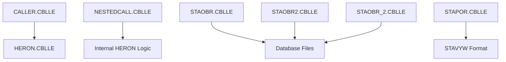
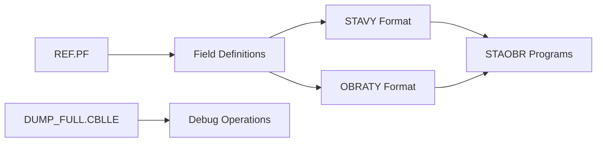

# COBOL Dependency Analysis Reference Guide

## Overview
This document serves as a comprehensive reference for understanding and managing dependencies in the COBOL Demo codebase. It provides guidance for developers, architects, and maintainers working with legacy COBOL systems.

## Table of Contents
- [Project Structure](#project-structure)
- [Dependency Categories](#dependency-categories)
- [Current Dependency Map](#current-dependency-map)
- [Analysis Framework](#analysis-framework)
- [Best Practices](#best-practices)
- [Modernization Guidelines](#modernization-guidelines)
- [Risk Assessment Matrix](#risk-assessment-matrix)

## Project Structure

### Directory Layout
```
AS400/
├── COBOL_examples/
│   ├── CallingExample/
│   │   └── QCBLLESRC/
│   │       ├── CALLER.CBLLE      # Main calling program
│   │       ├── NESTEDCALL.CBLLE  # Nested program example
│   │       └── HERON.CBLLE       # Called mathematical function
│   ├── QCBLLESRC/                # COBOL source members
│   ├── QCLSSRC/                  # CL command source
│   └── QDDSSRC/                  # DDS database definitions
└── OpenCobol/                    # Open COBOL examples
```

## Dependency Categories

### 1. Program-to-Program Dependencies
| Type | Description | Example | Risk Level |
|------|-------------|---------|------------|
| **Direct Call** | CALL statement to external program | `CALLER → HERON` | Low |
| **Nested Program** | Internal program structure | `NESTEDCALL` contains internal programs | Medium |
| **Dynamic Call** | Runtime program resolution | Variable program names | High |

### 2. Data Structure Dependencies
| Type | Description | Example | Impact |
|------|-------------|---------|--------|
| **Copybook** | Shared data structures | `DUMP_FULL.CBLLE` | High |
| **DDS Generated** | Database file layouts | `STAVY`, `OBRATY` formats | Critical |
| **Working Storage** | Shared variable definitions | Common field patterns | Medium |

### 3. Database Dependencies
| File | Purpose | Dependent Programs | Change Impact |
|------|---------|-------------------|---------------|
| `REF.PF` | Master reference data | Multiple inventory programs | Critical |
| `STAVY.PF` | Status/State data | `STAOBR*` programs | High |
| `OBRATY.PF` | Transaction data | Reporting programs | High |

## Current Dependency Map

### Program Call Hierarchy


### Data Flow Dependencies


## Analysis Framework

### Dependency Assessment Checklist

#### 1. Data Flow Analysis
- [ ] **Copybook Usage**: Identify all COPY statements and included members
- [ ] **Database File Access**: Map all file operations (READ, WRITE, UPDATE, DELETE)
- [ ] **Parameter Passing**: Document USING clauses in CALL statements
- [ ] **Global Variables**: Identify shared working storage areas

#### 2. Circular Dependency Detection
```cobol
// Pattern to avoid:
PROGRAM-A calls PROGRAM-B
PROGRAM-B calls PROGRAM-C  
PROGRAM-C calls PROGRAM-A  // ❌ Circular dependency
```

#### 3. Modularity Assessment
- **Cohesion**: Functions within a program serve a single purpose
- **Coupling**: Minimal dependencies between programs
- **Reusability**: Common logic extracted into callable modules

### Analysis Commands

#### Find Program Calls
```bash
# Search for CALL statements
grep -r "CALL.*PROGRAM" AS400/COBOL_examples/
grep -r "CALL.*\"" AS400/COBOL_examples/
```

#### Find Copybook Dependencies
```bash
# Search for COPY statements
grep -r "COPY" AS400/COBOL_examples/
grep -r "INCLUDE" AS400/COBOL_examples/
```

#### Database File Dependencies
```bash
# Find file declarations
grep -r "SELECT.*ASSIGN" AS400/COBOL_examples/
grep -r "FD " AS400/COBOL_examples/
```

## Best Practices

### 1. Dependency Management
- **Document all external calls** in program headers
- **Use standardized parameter interfaces**
- **Implement error handling** for all CALL statements
- **Avoid deep call hierarchies** (max 3-4 levels)

### 2. Copybook Design
```cobol
      * Good: Focused, single-purpose copybook
       01  CUSTOMER-RECORD.
           05  CUST-ID         PIC X(10).
           05  CUST-NAME       PIC X(30).
           05  CUST-STATUS     PIC X(1).

      * Avoid: Monolithic copybooks with mixed concerns
```

### 3. Program Structure
```cobol
      * Recommended pattern:
       IDENTIFICATION DIVISION.
       PROGRAM-ID. BUSINESS-FUNCTION.
      
       DATA DIVISION.
       WORKING-STORAGE SECTION.
       COPY 'STANDARD-FIELDS'.
       COPY 'ERROR-HANDLING'.
      
       LINKAGE SECTION.
       01  INPUT-PARAMETERS    PIC X(100).
       01  OUTPUT-PARAMETERS   PIC X(100).
       01  RETURN-CODE         PIC 9(2).
```

## Modernization Guidelines

### Phase 1: Documentation and Mapping
1. **Create dependency matrix** for all programs
2. **Document business rules** embedded in each program
3. **Identify reusable components**

### Phase 2: Refactoring Preparation
1. **Extract common functions** into service programs
2. **Standardize error handling**
3. **Implement consistent naming conventions**

### Phase 3: Architecture Evolution
1. **Service-oriented decomposition**
2. **API layer introduction**
3. **Database abstraction layer**

### Migration Patterns

#### From Nested to Modular
```cobol
// Legacy Pattern (Nested)
IDENTIFICATION DIVISION.
PROGRAM-ID. MAIN-PROGRAM.
    // ... main logic ...
    
    IDENTIFICATION DIVISION.
    PROGRAM-ID. NESTED-FUNCTION.
    // ... nested function ...
    END PROGRAM NESTED-FUNCTION.
END PROGRAM MAIN-PROGRAM.

// Modern Pattern (Modular)
// File 1: MAIN-PROGRAM.CBLLE
CALL 'MATH-FUNCTIONS' USING INPUT-DATA OUTPUT-DATA

// File 2: MATH-FUNCTIONS.CBLLE  
IDENTIFICATION DIVISION.
PROGRAM-ID. MATH-FUNCTIONS.
```

## Risk Assessment Matrix

### Dependency Risk Levels

| Risk Level | Criteria | Impact | Mitigation |
|------------|----------|--------|------------|
| **Critical** | Database schema changes affect 5+ programs | System-wide failure | Create abstraction layer |
| **High** | Shared copybook used by 3+ programs | Module compilation cascade | Version control copybooks |
| **Medium** | Program calls with complex parameter passing | Integration issues | Standardize interfaces |
| **Low** | Simple mathematical function calls | Isolated failures | Unit testing |

### Current Codebase Assessment

| Component | Risk Level | Reason | Recommendation |
|-----------|------------|--------|----------------|
| `REF.PF` dependencies | Critical | Master reference data | Implement data access layer |
| `STAOBR*` programs | High | Duplicate functionality | Consolidate into parameterized module |
| `HERON` calls | Low | Simple mathematical function | No immediate action needed |
| `DUMP_FULL` usage | Medium | Inconsistent implementation | Standardize error handling |

## Common Anti-Patterns to Avoid

### 1. God Programs
```cobol
// ❌ Avoid: One program doing everything
PROGRAM-ID. MASTER-PROCESSOR.
// 2000+ lines handling inventory, orders, customers, reports...

// ✅ Prefer: Focused, single-responsibility programs
PROGRAM-ID. INVENTORY-MANAGER.
PROGRAM-ID. ORDER-PROCESSOR.
PROGRAM-ID. CUSTOMER-SERVICE.
```

### 2. Copy-Paste Programming
```cobol
// ❌ Avoid: Duplicated logic across programs
// STAOBR.CBLLE, STAOBR2.CBLLE, STAOBR_2.CBLLE

// ✅ Prefer: Shared service programs
CALL 'INVENTORY-SERVICES' USING OPERATION-CODE INPUT-DATA OUTPUT-DATA
```

### 3. Hard-Coded Dependencies
```cobol
// ❌ Avoid: Hard-coded program names
CALL 'PROD-HERON-V2-FINAL' USING A B C AREA

// ✅ Prefer: Configurable dependencies
CALL MATH-PROGRAM-NAME USING A B C AREA
```

## Tools and Utilities

### Dependency Analysis Scripts
```bash
#!/bin/bash
# analyze-dependencies.sh

echo "=== COBOL Dependency Analysis ==="
echo "1. Finding all CALL statements..."
find AS400/ -name "*.CBL*" -exec grep -l "CALL" {} \;

echo "2. Finding all COPY statements..."
find AS400/ -name "*.CBL*" -exec grep -l "COPY" {} \;

echo "3. Database file dependencies..."
find AS400/QDDSSRC/ -name "*.PF" -o -name "*.LF"
```

### VS Code Extensions
- **COBOL Language Support**: Syntax highlighting and basic IntelliSense
- **Dependency Graph**: Visualize program call hierarchies
- **Legacy Code Analysis**: Identify code smells and modernization opportunities

## Conclusion

This reference guide provides a framework for managing COBOL dependencies effectively. Regular review and updating of this document ensures it remains current with the evolving codebase.

### Key Takeaways
1. **Document dependencies explicitly** in all programs
2. **Minimize coupling** between components
3. **Plan refactoring** in phases to reduce risk
4. **Monitor dependency changes** through version control
5. **Use this guide** as a checklist for code reviews

---

**Last Updated**: July 21, 2025  
**Version**: 1.0  
**Maintainer**: Development Team  
**Review Cycle**: Quarterly
